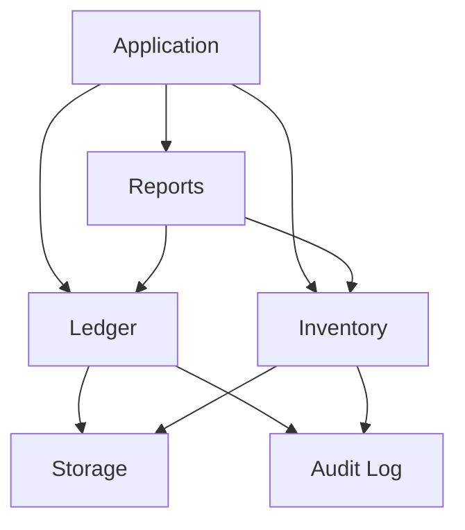

# Mini-Ledger

A C++20 accounting and inventory engine designed around core ERP-style concepts such as double-entry bookkeeping, persistent storage, inventory management, indexing, audit logging, reporting, write-ahead logging, crash recovery, and concurrent access.

The project is built from scratch in modern C++ with CMake and focuses on understanding how the core components of a financial/ERP system can be designed and implemented at the systems level.

---

## Features

- Double-entry accounting
- Account types and balance handling
- Integer-based money representation using paise
- Transaction validation
- Persistent binary storage
- Product and warehouse management
- Inventory purchase, sale, and transfer operations
- Hash-based indexing
- Audit logging
- Trial Balance reporting
- Profit & Loss reporting
- Balance Sheet reporting
- Account ledger reporting
- Inventory reporting
- Write-Ahead Logging (WAL)
- WAL-based transaction recovery
- Concurrent ledger operations
- Concurrent inventory operations
- Automated unit testing with GoogleTest
- Performance benchmarks

---

## Architecture

Mini-Ledger uses a simple layered design. The main application works with the Ledger, Inventory, and Reporting modules, while Storage and Audit Log provide supporting functionality.



### Main Components

#### Ledger

Responsible for:

- Managing accounts
- Posting transactions
- Validating balanced transactions
- Updating account balances
- Maintaining transaction history
- Recovering transactions from the WAL
- Supporting concurrent access

#### Inventory

Responsible for:

- Products
- Warehouses
- Stock quantities
- Purchases
- Sales
- Warehouse transfers
- Concurrent inventory operations

#### Storage

Responsible for:

- Serializing accounts
- Serializing transactions
- Saving data to disk
- Loading data from disk
- Temporary-file replacement during persistence

#### WAL

The Write-Ahead Log provides a recovery mechanism for transactions.

Transactions are written to the WAL before being applied to the in-memory ledger state.

On recovery, incomplete or unapplied transactions can be replayed from the WAL.

#### Index

The project uses a hash-based `Index<Key, Value>` abstraction backed by `std::unordered_map`.

It provides:

- Insert
- Find
- Contains
- Erase
- Size
- Value retrieval

#### Audit Log

Records important operations such as:

- Transactions
- Purchases
- Sales
- Inventory transfers

#### Report Engine

Provides:

- Trial Balance
- Profit & Loss
- Balance Sheet
- Account Ledger
- Inventory Report

---

## Accounting Model

The ledger supports five account types:

```text
ASSET
LIABILITY
EQUITY
REVENUE
EXPENSE
```

Account balance behavior follows standard accounting rules.

### Assets and Expenses

```text
Debit  → Increase
Credit → Decrease
```

### Liabilities, Equity and Revenue

```text
Debit  → Decrease
Credit → Increase
```

Transactions must satisfy the double-entry accounting rule:

```text
Total Debits = Total Credits
```

Unbalanced transactions are rejected before they modify the ledger.

---

## Money Representation

Financial values are represented using integer paise rather than floating-point values.

For example:

```text
₹100.50
   ↓
10050 paise
```

This avoids floating-point precision problems when performing financial calculations.

The `Money` class provides arithmetic and comparison operations over the integer representation.

---

## Persistence

Mini-Ledger uses binary serialization for persistent storage.

The main persisted data includes:

```text
data/
├── accounts.dat
└── transactions.dat
```

The storage layer serializes individual fields instead of writing complete C++ objects directly to disk.

This keeps the persistence format explicit and controlled.

Generated runtime data is excluded from Git.

---

## Write-Ahead Logging

The WAL follows the basic write-ahead principle:

```text
Transaction
     │
     ▼
Write to WAL
     │
     ▼
Apply to Ledger
     │
     ▼
Persist State
```

If the application terminates before the transaction is fully persisted, the WAL can be used during recovery.

Recovery performs the following:

```text
Read WAL
   │
   ▼
Check transaction
   │
   ├── Already applied → Skip
   │
   └── Not applied
          │
          ▼
     Validate accounts
          │
          ▼
     Apply transaction
```

The WAL also handles incomplete final records by ignoring an incomplete trailing record rather than treating it as a valid transaction.

---

## Concurrency

The ledger and inventory components use `std::mutex` to protect shared state.

### Ledger

Concurrent operations are protected when:

- Adding accounts
- Posting transactions
- Reading accounts
- Reading transactions
- Recovering transactions
- Loading state

### Inventory

Concurrent operations are protected when:

- Adding products
- Adding warehouses
- Purchasing stock
- Selling stock
- Transferring stock
- Reading stock

Operations that modify multiple pieces of related state are performed while holding the same mutex.

For example, an inventory transfer:

```text
Bangalore
    │
    │  Transfer
    ▼
Mysore
```

updates both warehouse quantities as one protected operation.

---

## Testing

The project uses GoogleTest for automated testing.

The current test suite contains:

```text
54 tests
```

Coverage includes:

- Money
- Account
- Transaction
- Ledger
- Inventory
- Storage
- WAL
- WAL recovery
- Index
- Concurrent ledger operations
- Concurrent inventory operations

### Test Coverage

```text
Money
 ├── Storage
 ├── Arithmetic
 └── Zero values

Account
 ├── Asset behavior
 ├── Liability behavior
 ├── Equity behavior
 ├── Revenue behavior
 └── Expense behavior

Transaction
 ├── Balanced transactions
 ├── Unbalanced transactions
 ├── Invalid entries
 └── Entry storage

Ledger
 ├── Transaction posting
 ├── Validation
 ├── Recovery
 └── Concurrency

Inventory
 ├── Products
 ├── Warehouses
 ├── Purchase
 ├── Sale
 ├── Transfer
 └── Concurrency

Storage
 ├── Account persistence
 ├── Transaction persistence
 └── Empty storage

WAL
 ├── Append
 ├── Read
 ├── Multiple records
 ├── Clear
 └── Incomplete records

Index
 ├── Insert
 ├── Find
 ├── Contains
 ├── Update
 ├── Erase
 ├── Size
 └── Values
```

### Running Tests

Build the test target:

```powershell
cmake --build build --target unit_tests --config Debug --parallel 1
```

Run the complete test suite:

```powershell
ctest --test-dir build -C Debug --output-on-failure
```

Expected result:

```text
54/54 tests passed
```

---

## Benchmarks

Mini-Ledger includes benchmarks for:

- Index/search performance
- Transaction processing
- Persistent storage

The benchmarks use C++ `<chrono>` for timing and are implemented as standalone executables.

### Search Benchmark

The search benchmark compares:

```text
Linear search
      vs
Hash-based indexed search
```

using one million products.

The indexed lookup is backed by `std::unordered_map`.

### Results

Measured in a local Release build. Timings depend on hardware and runtime conditions; these values are a single-run baseline.

| Benchmark | Workload | Result |
|---|---|---:|
| Linear search | 1,000,000 products | 5,200 microseconds |
| Indexed search | 1,000,000 products | 1 microsecond |
| Transaction processing | 10,000 transactions | 9 ms (about 1.11 million transactions/second) |
| Account save | 10,000 accounts | 8 ms |
| Account load | 10,000 accounts | 21 ms |
| Transaction save | 10,000 transactions | 15 ms |
| Transaction load | 10,000 transactions | 27 ms |

Both search methods found the target product. The ledger stored all 10,000 transactions, and storage loaded all 10,000 accounts and transactions.

These results are hardware and environment dependent and should not be treated as an absolute performance guarantee.

---

## Version History

### v0.1 — Basic Ledger

Implemented the initial ledger system:

- Accounts
- Transactions
- Double-entry validation
- Basic balance management

### v0.2 — Accounting Model

Added:

- Account types
- `Money`
- Accounting-specific debit/credit behavior

### v0.3 — Persistent Storage

Added:

- Binary serialization
- Account persistence
- Transaction persistence
- Storage loading

### v0.4 — Inventory

Added:

- Products
- Warehouses
- Stock movements
- Purchase
- Sale
- Transfer

### v0.5 — Indexing

Added:

- Generic `Index<Key, Value>`
- Hash-based lookup
- Search benchmark

### v0.6 — Audit Logging

Added:

- `AuditLog`
- Transaction logging
- Inventory operation logging

### v0.7 — Reporting

Added:

- Trial Balance
- Profit & Loss
- Balance Sheet
- Account Ledger
- Inventory Report

### v0.8 — WAL and Recovery

Added:

- Write-Ahead Log
- Transaction recovery
- Incomplete WAL record handling
- Recovery validation

### v0.9 — Testing and Concurrency

Added:

- GoogleTest integration
- 54 automated tests
- Ledger concurrency protection
- Inventory concurrency protection
- Recovery tests
- Index tests
- Concurrent purchase, sale and transfer tests

### v0.10 — Performance and Cleanup

Added:

- Transaction benchmark
- Storage benchmark
- Performance measurements
- Project cleanup
- Documentation improvements

---

## Build Requirements

### Requirements

- C++20-compatible compiler
- CMake 3.20 or newer
- Git
- GoogleTest is downloaded automatically through CMake FetchContent

The project has been developed and tested using a Windows/MSVC environment.

---

## Build

Clone the repository:

```bash
git clone <repository-url>
cd mini-ledger
```

Configure the project:

```powershell
cmake -S . -B build
```

Build:

```powershell
cmake --build build --config Debug --parallel 1
```

---

## Run the Application

The main executable is:

```text
mini-ledger
```

With a Visual Studio multi-configuration build, it can be found under:

```text
build/Debug/
```

---

## Running Benchmarks

Build the project:

```powershell
cmake --build build --config Debug --parallel 1
```

The benchmark executables include:

```text
benchmark_search
benchmark_transactions
benchmark_storage
```

They can be run from the generated Debug directory.

---

## Design Highlights

### Double-Entry Accounting

Every transaction contains debit and credit entries and must satisfy:

```text
Σ Debit = Σ Credit
```

before it can be posted.

### Integer Financial Representation

Money is represented using integer paise rather than floating-point values.

### Explicit Serialization

Persistent data is serialized field-by-field instead of dumping raw C++ objects to disk.

### Write-Ahead Logging

Transactions are written to the WAL before modifying ledger state, allowing recovery after an interruption.

### Hash-Based Indexing

`Index<Key, Value>` provides average constant-time hash-table lookup.

### Dependency Injection

Components such as `Ledger` and `Inventory` can receive an `AuditLog` and the ledger can receive a `WAL`, reducing direct coupling between components.

### Thread Safety

Shared ledger and inventory state is protected using mutexes, allowing multiple threads to safely access the system.

---

## Current Limitations

This project is an educational systems-oriented implementation and is not intended to replace a production accounting system.

Current limitations include:

- Binary storage format is not designed for cross-platform portability.
- Storage operations do not provide a single atomic commit across all data files.
- WAL recovery is intentionally lightweight.
- There is no database engine underneath the storage layer.
- No distributed transaction support.
- No network API.
- No authentication or authorization layer.
- Benchmark results are environment dependent.

---

## Future Improvements

Possible future work includes:

- Storage format versioning and magic headers
- Stronger crash consistency guarantees
- More advanced WAL recovery
- Improved indexing strategies
- Additional performance optimization
- More extensive stress testing
- REST API
- Web-based dashboard
- Database-backed persistence
- Multi-user access control
- Distributed processing

---

## Technology Stack

```text
Language       C++20
Build System   CMake
Testing        GoogleTest
Storage        Custom binary serialization
Indexing       std::unordered_map
Concurrency    std::mutex / std::thread
Benchmarking   std::chrono
```

---

## Development Milestones

```text
v0.1  ── Basic Ledger
  │
v0.2  ── Accounting Model
  │
v0.3  ── Persistent Storage
  │
v0.4  ── Inventory
  │
v0.5  ── Indexing
  │
v0.6  ── Audit Logging
  │
v0.7  ── Reporting
  │
v0.8  ── WAL + Recovery
  │
v0.9  ── Testing + Concurrency
  │
v0.10 ── Performance + Cleanup
```
